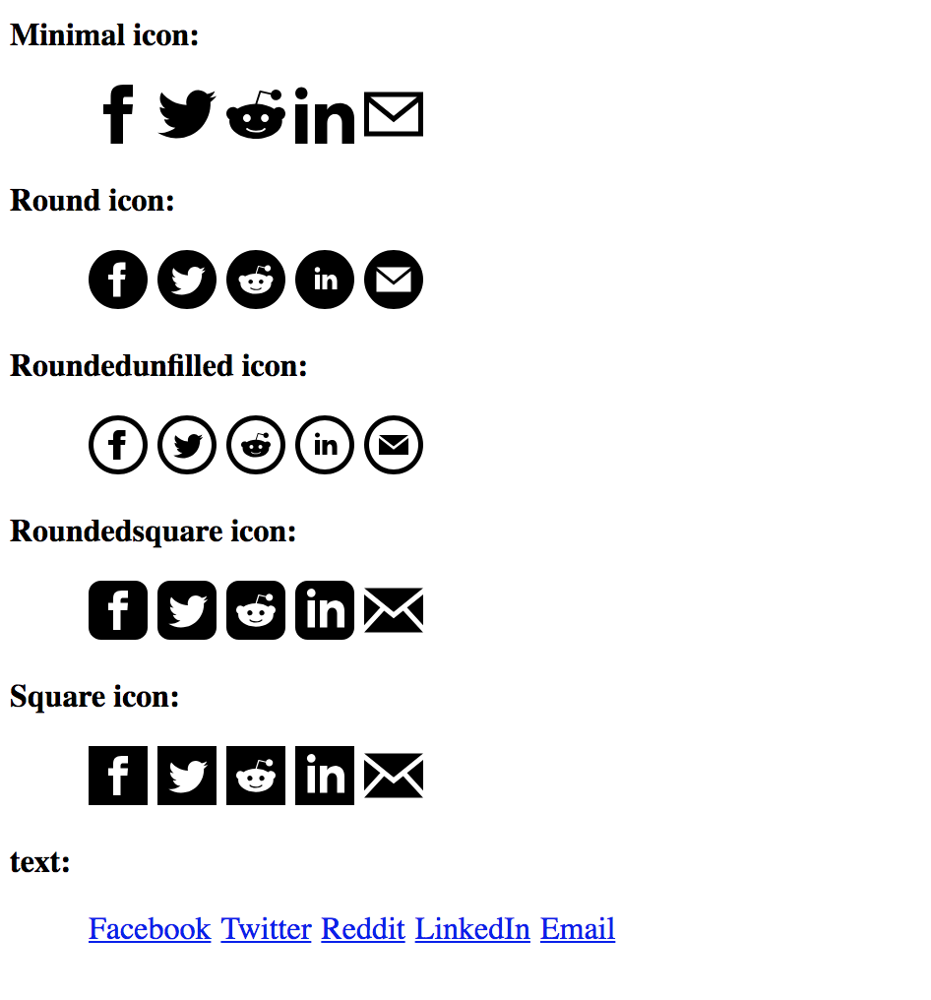

## Add social share links through one simple and lightweight React component

A simple React component that adds React share links with SVG icons in your selected color. You don't have to add an `<Twittershare /> <FacebookShare /> <RedditShare />...` for each service you want to share to. Instead you add the react-simple-social component once: `<SocialShare sites={['facebook', 'twitter', 'reddit', 'linkedin', 'email']} />` and specify which share links it shall contain as a prop. And its lightweight and should work with React version 15 and 16.

It contains 5 inline SVG icon types; minimal, round, roundedunfilled, roundedsquare, square and text. These can be passed as props to the component. They look like and are all taken from iconmonstr.com:



## Usage

Install the package running:

```
npm i react-simple-social
```
Or

```
yarn add react-simple-social
```

Then use it in your React component:

```javascript
import React, { Component } from 'react';

import SocialShare from 'react-simple-social';

export class MyComponent extends Component {
  render() {
    return (
      <div>
        Hello world!
        <SocialShare 
          url="https://example.com/my-blog-post"
          title="This is my blog post"
          sites={['facebook', 'twitter', 'reddit', 'linkedin', 'email']}
          color='gray'
          width="20"
          height="20"
          theme="minimal"
        />
      </div>
    );
  }
}
```

You can configure the following props:

| Prop   | Value                                                                                                                    |
|--------|--------------------------------------------------------------------------------------------------------------------------|
| url    | full url to share (required)                                                                                             |
| title  | title of the shared content (only used on some sites)                                                                    |
| sites  | wanted share icons, possibilities: sites={['facebook', 'twitter', 'reddit', 'linkedin', 'email']}                        |
| height | height of the icon                                                                                                       |
| width  | width of the icon                                                                                                        |
| color  | color of the icon                                                                                                        |
| theme  | which of the icon theme to use (or raw text) possibilities: minimal, round, roundedunfilled, roundedsquare, square, text |

## Thanks

Icons are from: http://iconmonstr.com

Build using boilerplate: https://github.com/lassegit/npm-react-module
